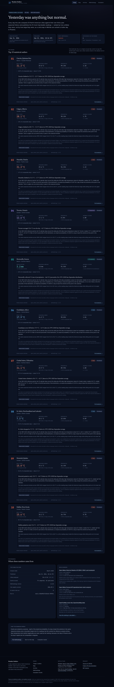
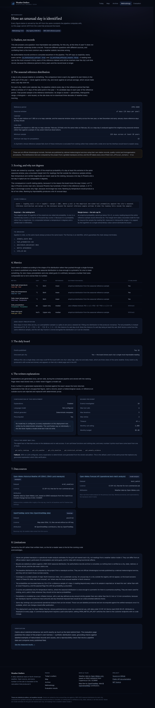

# Weather Outliers

Every day, this application analyses yesterday's weather across 50 North American
cities and publishes the ten most **statistically unusual** events it found —
with the arithmetic shown.

Not the hottest place. Not the wettest. The most *surprising*: a 12 °C day in
Phoenix is unremarkable and a 12 °C day in Iqaluit in January is not, and a
ranking that cannot tell those apart is a ranking of climate, not of news.

**Live site:** <https://weather-outliers-production.up.railway.app> — on Railway,
publishing real ERA5 data on a schedule (two cron workers: the daily analysis at
09:30 UTC, the reanalysis finalisation at 11:00 UTC). See
[docs/deployment.md](docs/deployment.md) to reproduce it.

One honest caveat about what that site currently shows: a 30-year baseline costs
about 391 weighted Open-Meteo calls per city against a free-tier allowance of
10,000 a day, so the climatology is still being filled in a few cities at a time.
Cities without a baseline are **excluded** from ranking rather than scored against
nothing, which means the board is drawn from the cities built so far. That is a
smaller board, never a wrong one — see the quota section below.

---



---

## What it claims, and what it does not

This is the part that matters most, so it comes first.

**It does claim:** that a given day's value was unusual relative to a 1991–2020
reference distribution for that city and that time of year, and it shows the
sample size, the percentile, the tail probability and the margin over the previous
extreme in the reference period.

**It does not claim records.** Verifying a city, state or national record requires
an authoritative record source, and that is not implemented here. Everything on
the site is labelled a *statistical outlier* or an *unusual event*. The word
"record" does not appear as a claim anywhere in the output.

**It does not claim station observations.** The data is ERA5 reanalysis — a
physical model constrained by observations, not a thermometer reading. Every
figure is labelled with its source dataset and its tier (`final` or
`provisional`).

**It does not rank by magnitude.** Raw temperature and rainfall totals are shown
but never used as the cross-metric ranking, for the Phoenix/Iqaluit reason above.

**It does not present z-scores as universally comparable.** Daily precipitation is
zero-inflated and wind gusts are right-skewed; a z-score on either is a number
without a meaning. Where the distribution does not support it, the site says
`z-score not applicable` and ranks on the empirical tail instead.

The full treatment is in [docs/methodology.md](docs/methodology.md), including a
"known limitations" section that is longer than most projects would be
comfortable publishing.

---

## How it works

```
                    ┌──────────────────────────────────────────────┐
                    │ data/cities.json  (50 cities, 26 IANA zones) │
                    └───────────────────────┬──────────────────────┘
                                            │ seed-cities
  ┌─────────────────┐   ERA5 archive        ▼
  │   Open-Meteo    │──── 1991-2020 ──▶ ┌─────────────────────────────┐
  │  (ERA5 + NRT)   │                   │  baseline climatology cache │
  └────────┬────────┘                   │  1,825 rows per city        │
           │  yesterday                 └──────────────┬──────────────┘
           ▼                                           │
  ┌─────────────────────┐                              │
  │ daily observations  │──────────────┬───────────────┘
  └─────────────────────┘              ▼
                          ┌────────────────────────────────┐
                          │ anomaly engine                 │
                          │  percentile, tail probability,  │
                          │  z-score where valid, margin   │
                          └───────────────┬────────────────┘
                                          ▼
                          ┌────────────────────────────────┐
                          │ deterministic ranking          │
                          │  surprisal -log10(p), one      │
                          │  event per city, fixed         │
                          │  tie-break chain               │
                          └───────────────┬────────────────┘
                                          ▼
                          ┌────────────────────────────────┐
                          │ investigation agent (optional) │
                          │  5 tools, validated output,    │
                          │  deterministic fallback        │
                          └───────────────┬────────────────┘
                                          ▼
                          ┌────────────────────────────────┐
                          │ atomic publish ──▶ PostgreSQL  │
                          └───────────────┬────────────────┘
                                          ▼
                    read-only JSON API ──▶ Next.js website
```

### The ranking, in one paragraph

For each city and metric, the observed value is compared against the empirical
distribution of the same calendar window (±7 days) across 30 years — up to 450
samples. The primary score is **surprisal**, `−log₁₀(p_tail)`: a one-in-a-thousand
event scores 3 regardless of whether it is a temperature, a rainfall total or a
gust, which is what makes cross-metric comparison legitimate. A margin term,
`0.5 · log₁₀(1 + margin/IQR)`, separates "beat the old extreme by a hair" from
"beat it by a mile". Ties break through a fixed five-step chain ending in city id,
so the same inputs always produce the same board — which the evaluation suite
checks by re-running a day and comparing byte for byte.

### The agent

One agent, not a committee. It gets five tools (city context, the baseline
distribution, the city's own history for that metric, the same day across other
cities, and the published methodology), a hard cap on tool calls and iterations,
and a Pydantic schema its output must satisfy. Claims it makes are checked against
the tool results it actually received; an explanation that asserts a number the
data does not contain is rejected rather than published.

**No API key is required.** With `LLM_PROVIDER=none` the site generates
deterministic template explanations from the same verified statistics, and
everything else works identically. The agent is an enhancement, not a dependency.

---

## Stack

| Layer | Choice | Why |
| --- | --- | --- |
| Backend | Python 3.13, FastAPI, Pydantic v2, SQLAlchemy 2.0, Alembic, psycopg 3 | Validation at the boundary and migrations from day one. |
| Statistics | Hand-implemented | No NumPy, no pandas, no SciPy. Percentiles, quantile interpolation and the zero-inflated mixture are ~200 lines, are unit-tested against known values, and keep the image small and the arithmetic auditable. |
| Database | PostgreSQL 17 | Seven tables. CI applies the full migration chain against a real PostgreSQL 17 service; the test suite itself runs on in-memory SQLite, because it is testing statistics and application logic rather than SQL dialect. |
| Frontend | Next.js 16 (App Router), React 19, TypeScript, Tailwind v4 | Server components fetch over the private network, so no API credential can reach the browser. |
| Map | MapLibre GL + OpenFreeMap | No token, no account, ODbL/OSM tiles. |
| Charts | None | The three visualisations are SVG. A charting dependency for three charts is a liability, not a saving. |
| Deployment | Docker, Railway | Same image for API and worker; see [docs/deployment.md](docs/deployment.md). |

---

## Quick start

```bash
cp .env.example .env
docker compose up --build

# in another terminal
docker compose exec api alembic upgrade head
docker compose exec api python -m app.pipeline seed-cities
docker compose exec api python -m app.pipeline build-baselines
docker compose exec api python -m app.pipeline run
```

Website at <http://localhost:3050>, API at <http://localhost:8000/docs>.

The default `WEATHER_PROVIDER=fixture` uses deterministic synthetic data, needs no
network and no quota, and labels every figure `synthetic_fixture_v1` so it can
never be mistaken for real weather. Switch to `open_meteo` for real data, after
reading the free-tier budget note below.

Native setup, the full CLI reference and the known time sinks are in
[docs/local-development.md](docs/local-development.md).

---

## The provider quota, because it is the interesting engineering problem

Open-Meteo does not bill in HTTP requests. It bills in **weighted API calls**:

```
weight = max(1, (variables / 10) × (days / 14))
```

One 10-year chunk of five daily variables is a *single* HTTP request and about
**130 weighted calls**. A request-counting rate limiter set to a comfortable-looking
120/minute was therefore running roughly 26× over the real allowance, and a
baseline build lost twelve cities to 429s before this was understood.

The client now prices each request before sending it and meters three sliding
windows — minutely, hourly, daily — against the published free-tier allowances
with headroom. Short waits it waits out; a window that would mean sleeping for an
hour raises `ProviderBudgetExhausted` so the build stops cleanly instead of
blocking. And a 429 backs off past the next minute boundary, because exponential
backoff of 2s, 4s, 8s spends every retry inside the same exhausted minute.

Measured consequences, on the free tier:

| Job | Cost | Reality |
| --- | --- | --- |
| Daily pipeline, 50 cities | ~50 weighted calls | 0.5% of the daily allowance. |
| Full 30-year baseline, 50 cities | ~19,600 weighted calls | Against 10,000/day. A resumable 2–3 day cold start. |

The second row is a real constraint, not a rounding error, and the system is
designed around it: baselines commit per city, a rerun skips what exists, and
cities without a baseline are excluded from ranking rather than scored against
nothing. A partial cache yields a smaller board, never a wrong one.

The 18 tests in `backend/tests/test_provider_quota.py` pin all of this, including
reproducing Open-Meteo's own published worked examples.

---

## Verification

Everything below is a measured figure from this repository, not an estimate.

```
ruff check backend evals          All checks passed
pytest                            255 passed
tsc --noEmit                      clean
eslint .                          clean
python -m evals.runner            4/4 suites, 62/62 checks, PASSED
```

CI additionally builds both container images and smoke-tests them: that the backend
image can import the module it launches, that `app` resolves to the source in the image
rather than to an installed copy of it, and that the website container answers HTTP on
`0.0.0.0`. That job exists because a Dockerfile that builds and then cannot import its
own entrypoint is a deploy that restart-loops, and that happened here once.

The evaluation harness (`python -m evals.runner`, report committed at
`evals/reports/latest.json` and rendered at `/evaluation`) runs four suites:

| Suite | Checks | What it establishes |
| --- | --- | --- |
| `unit_tests` | 5 | The statistics match independently computed expected values. |
| `grounding` | 25 | Every published explanation's factual claims trace to tool results the agent actually received. Fabricated figures are rejected. |
| `reproducibility` | 5 | Re-running the same date produces a byte-identical ranking. |
| `api_contract` | 27 | Every documented endpoint returns its documented schema. |

The report records its own caveats rather than leaving them to a reader: a run
without an LLM key states that it measured the guards and the deterministic
templates and makes no claim about any model's accuracy, and the reproducibility
suite states that it measures the machinery against deterministic fixture data,
not the accuracy of real weather.

There are no accuracy or latency percentages anywhere in this project. "Accuracy"
against a self-defined statistical measure would be a tautology, and no latency
benchmark has been run, so none is published.

---

## API

Read-only, no authentication, rate-limited, and every collection endpoint is
bounded.

| Endpoint | Returns |
| --- | --- |
| `GET /health` | Liveness and database connectivity. |
| `GET /api/rankings/latest` | The current published board. |
| `GET /api/rankings/{analysis_date}` | A specific day's board. |
| `GET /api/rankings` | Published dates, paginated. |
| `GET /api/cities` | The city registry, with baseline coverage. |
| `GET /api/cities/{city_id}` | One city and its most recent analysis. |
| `GET /api/cities/{city_id}/history` | That city's outlier history, bounded window. |
| `GET /api/events/{event_id}` | One event: every input, every intermediate value, the explanation and its sources. |
| `GET /api/methodology` | The active methodology version and every configured parameter. |

That last pair is the transparency claim made operational: the page shows the
calculation, and the API hands you every number that went into it.

---

## Pages

| Page | |
| --- | --- |
| `/` | The daily top ten, with analysis date and publication timestamp. |
| `/map` | The same events geographically. |
| `/city/[cityId]` | One city: its climatology, its history, its current standing. |
| `/archive` and `/archive/[date]` | Every previously published board. |
| `/methodology` | The method, in prose, versioned. |
| `/evaluation` | The committed evaluation report. |



Screenshots in `docs/screenshots/` carry a `manifest.json` recording the analysis
date, the methodology version and the source datasets behind the board in frame,
so a fixture-data capture cannot be passed off as a real one.

---

## Repository layout

```
Dockerfile   Backend image — API and worker. At the root because it needs data/,
             and because PaaS builders detect a Dockerfile at the context root
backend/     FastAPI app, statistics, provider adapters, agent, pipeline CLI, tests
frontend/    Next.js website — self-contained image, built with frontend/ as context
data/        Versioned city registry + selection rationale  (data/README.md)
evals/       Reproducible evaluation harness and its committed report
docs/        methodology, data-sources, deployment, local-development
```

---

## Data sources and licensing

* **Weather:** [Open-Meteo](https://open-meteo.com) — ERA5 reanalysis and
  near-real-time model data. Data under CC-BY 4.0; the free tier is for
  **non-commercial use only**. Attributed in the site footer.
* **Map tiles:** [OpenFreeMap](https://openfreemap.org) — OpenStreetMap data under
  ODbL. Attributed on the map.

Terms were read before either was adopted, and the alternatives considered and
rejected are recorded with reasons in [docs/data-sources.md](docs/data-sources.md).

## License

MIT — see [LICENSE](LICENSE).
